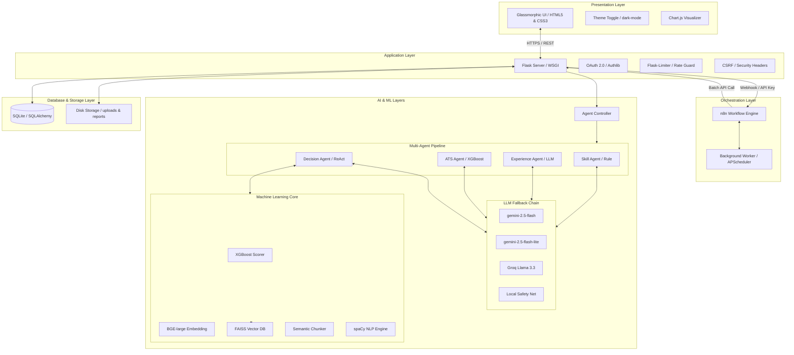
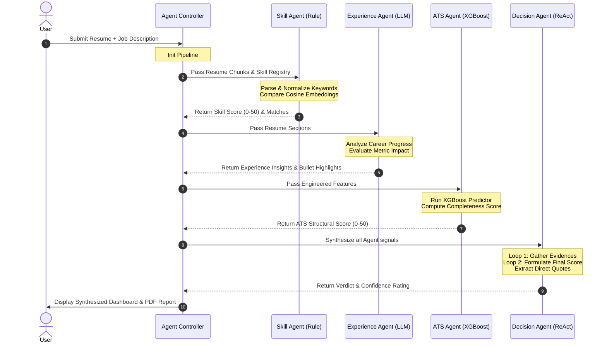

<p align="center">
  
</p>

<h1 align="center">Nexus CV</h1>

<p align="center">
  <strong>Production-Grade AI Resume Analyzer & Career Intelligence Platform</strong>
</p>

<p align="center">
  <a href="https://python.org"></a>
  <a href="https://flask.palletsprojects.com"></a>
  <a href="https://github.com/Rohit122622/Nexus-CV"></a>
  <br>
  <a href="#"></a>
  <a href="#"></a>
  <a href="#"></a>
  <a href="LICENSE"></a>
</p>

<p align="center">
  <em>Nexus CV is an enterprise-grade career intelligence platform that leverages multi-agent orchestrations, hybrid machine learning, and semantic RAG pipelines to deliver comprehensive ATS scoring, deep resume-to-job-description alignment, automated resume rewriting, and bulk candidate screening.</em>
</p>

---

## ⚡ Why Nexus CV is Different

Unlike simple keyword-matching ATS parsers or fragile, single-prompt LLM wrappers, **Nexus CV** brings a robust, defense-in-depth approach to resume intelligence:

1. **Hybrid Scoring Engine:** Combines heuristic rules (TF-IDF, keyword density, completeness) with a custom-trained **XGBoost machine learning model** to predict candidate viability with high analytical precision.
2. **4-Agent ReAct Pipeline:** Leverages specialized, collaborative LLM agents with native validation loops. The final verdict requires **strict evidence quotes** verified against actual text chunks.
3. **Resilient Multi-Model Fallbacks:** Features an automated, thread-safe, and self-healing LLM chain starting at Google Gemini, falling back to Groq, and landing on localized rules to guarantee 100% service availability.
4. **Self-Hosted Bulk Orchestration:** Combines a high-throughput Flask API with an asynchronous, self-hosted **n8n workflow engine** to extract, parse, clean, score, and rank batches of up to 50 resumes concurrently.

---

## ✨ Features Matrix

Nexus CV implements a comprehensive feature matrix designed to address every aspect of modern resume evaluation and career guidance:

| Feature Area | Sub-Feature | Status | Implementation Details |
| :--- | :--- | :---: | :--- |
| **Parsing & Analysis** | ✔ **ATS Scoring** | **Active** | Heuristic criteria + trained XGBoost regressor (7-feature vector) |
| | ✔ **TF-IDF Scoring** | **Active** | Curated skill registries & role density matching (0-30 scale) |
| | ✔ **Semantic JD Matching** | **Active** | BGE-large embedding similarity comparison against target JDs |
| | ✔ **NLP Pipeline** | **Active** | spaCy entity recognition, text normalization, and grammar patterns |
| **Advanced AI / RAG** | ✔ **Multi-Agent Reasoning** | **Active** | 4-agent collaborative pipeline (Skill, Experience, ATS, Decision) |
| | ✔ **ReAct Agents** | **Active** | DecisionAgent utilizes a 2-iteration Reasoning & Action loop |
| | ✔ **RAG Retrieval** | **Active** | FAISS vector index with skill/experience-heavy semantic chunk prioritization |
| | ✔ **Multi-Model Gemini Fallback** | **Active** | Direct chain: `gemini-2.5-flash` ➔ `gemini-2.5-flash-lite` with retry logic |
| | ✔ **Groq Fallback** | **Active** | Secondary LLM layer using Llama 3.3 (70B) for high-availability backup |
| **Resume & Comparison** | ✔ **Resume Generation** | **Active** | Interactive resume builder with ATS optimization & Gemini rewrite |
| | ✔ **Resume Comparison** | **Active** | Side-by-side versions diff, additions/deletions tracking, and gap analysis |
| | ✔ **Role Prediction** | **Active** | Zero-shot multi-role classifier using fine-tuned BART-large models |
| **Bulk Orchestration** | ✔ **Bulk Resume Screening** | **Active** | Concurrent batch parsing & ranking from ZIP archives up to 50 files |
| | ✔ **XGBoost Hybrid Ranking** | **Active** | Multi-signal weighting formula integrating ML-derived scores |
| | ✔ **n8n Orchestration** | **Active** | 11-node workflow with split-in-batches loop & per-file recovery |
| | ✔ **Batch Processing** | **Active** | Parallel background uploads and asynchronous result ranking |
| **Interface & Reports** | ✔ **Dashboard** | **Active** | Live analytics suite displaying metrics, best score, and history |
| | ✔ **Session History** | **Active** | Persistent SQLite store with secure user registration and login |
| | ✔ **PDF Reports** | **Active** | Beautiful, printable PDF reports compiled via ReportLab with auto-email |
| | ✔ **Dark Mode UI** | **Active** | Modern glassmorphism UI with responsive design & smooth animations |

---

## 🏗️ System Architecture

Nexus CV employs a modular, decoupled architecture consisting of multiple interactive layers designed to guarantee security, performance, and maximum resilience.



### Architectural Breakdown

#### 1. Frontend Layer
* A highly optimized, responsive web interface built on vanilla CSS and modern JS.
* Styled using **glassmorphic design principles**, supporting real-time theme switching (Dark/Light mode) without layout shifts.
* Utilizes **Chart.js** to render dynamic score charts, keyword density radars, and historical ATS progress curves.

#### 2. Backend Layer
* A secure, robust **Flask** application serving as the primary API controller, session manager, and static page renderer.
* Hardened with comprehensive security mechanisms: **Flask-WTF CSRF validation**, rate limiting via **Flask-Limiter**, and strict response-level security headers (XSS, HSTS, Frame Options).
* Supports standard authentication and secure social logins via **OAuth 2.0 (Google & Microsoft)**.

#### 3. AI Layer
* Houses the collaborative **Multi-Agent Reasoner** that orchestrates specialist agents through a defined workflow.
* Coordinates the multi-model **LLM fallback sequence**, ensuring automatic retry, thread-safe request throttling, and JSON output parsing normalization.

#### 4. ML Layer
* The core analytical powerhouse containing our custom-trained **XGBoost (XGBRegressor) model**, which evaluates candidates based on a 7-dimensional engineered feature space.
* Manages text embeddings via **BGE-large-en-v1.5** (run locally or hosted via lightweight pipelines) to calculate accurate semantic similarities.

#### 5. RAG Layer
* Powered by **FAISS**, this layer splits, chunks, indexes, and retrieves candidate resume sections.
* Utilizes **semantic chunking** which respects document boundaries (e.g. keeps experience bullet points grouped under the corresponding company) rather than blindly splitting by character counts.
* Prioritizes skill-dense and experience-heavy fragments to serve as contextual groundings for agent prompts.

#### 6. Orchestration Layer
* Uses a self-hosted **n8n workflow server** to handle intensive, non-blocking asynchronous operations such as multi-file ZIP uploads.
* Employs **APScheduler** background workers inside the Flask server to monitor file lifecycles and safely clean up uploads/reports directories every 6 hours.

#### 7. Database / Storage Layer
* Uses a structured **SQLite database** mapped through **SQLAlchemy** to store user accounts, analysis histories, and generated metadata.
* Coordinates local disk storage directories safely designated for short-lived PDFs and raw parsing intermediates.

---

## 🛠️ AI / ML Stack

Nexus CV organizes a sophisticated network of models, libraries, and frameworks to achieve both speed and analytical accuracy:

* **Flask & Python:** Serves as the central application runtime and endpoint handler.
* **FAISS (Facebook AI Similarity Search):** Provides ultra-fast local vector indices to perform inner-product searches during RAG operations.
* **TF-IDF & RapidFuzz:** Computes exact and fuzzy keyword alignments, normalizing acronyms (e.g., "ML" matching "Machine Learning") and scoring critical skill density.
* **XGBoost (XGBRegressor):** An ensemble gradient-boosting regressor trained on engineered features to predict candidate fit score adjustments based on structured historical patterns.
* **spaCy (en_core_web_sm):** Executes deep natural language processing including POS tagging, entity recognition, and grammar parsing to isolate professional experience blocks.
* **Sentence Transformers (BGE-large-en-v1.5):** Translates resumes and job descriptions into high-density 1024-dimensional vector spaces for semantic similarity analysis.
* **Google Gemini API:** Primary generative model powering extensive resume rewriting, structured roadmap recommendations, and collaborative agent evaluation.
* **Groq API:** Low-latency fallback host deploying Llama 3.3 (70B) to handle peak load queries or Gemini quota exhaustions.
* **n8n:** Visual orchestrator managing multi-stage pipeline flow, split loops, and error-handling branches.
* **Chart.js:** Client-side HTML5 canvas renderer producing sleek, interactively hovered resume analytical charts.
* **pdfplumber & ReportLab:** Core document components—the former extracts clean text from multi-column resume PDFs while the latter compiles gorgeous, branded candidate analysis summaries.
* **Regex Engine:** Performs structured cleaning, email/phone harvesting, and initial document structure detection.
* **LLM Agents:** Collaborating instances of specialized AI bots executing under localized instructions to evaluate resume quality.

---

## 🤖 Multi-Agent Pipeline

Nexus CV splits complex candidate evaluation into a modular **4-Agent Pipeline** coordinate by an `AgentController` to eliminate bias and produce highly structured verdicts:



### The Specialist Agents
1. **SkillAgent (Deterministic / Embedding):** Checks for technical and soft skill match-rates. It uses **BGE-large** embeddings to capture semantic synonyms and applies fuzzy matching to map colloquial phrasing to industry standards. No LLM calls are used, keeping it deterministic and fast.
2. **ExperienceAgent (LLM-Assisted):** Evaluates career trajectory, leadership markers, and qualitative progression. It analyzes whether bullet points focus on responsibilities or tangible achievements using impact metrics (e.g., "reduced latency by 40%").
3. **ATSAgent (Machine Learning):** Extracts 7 structural and statistical features and feeds them into the pre-trained **XGBoost regressor** alongside a standard section-completeness check.
4. **DecisionAgent (ReAct Reasoning):** The pipeline's brain. It takes outputs from the previous three agents, reasons over their findings, extracts **direct verification quotes** from the resume, evaluates its own confidence (High/Medium/Low), and issues a final, mathematically aligned score and qualitative verdict.

### ReAct (Reasoning and Action) Loop
The **DecisionAgent** executes a 2-iteration ReAct loop:
* **Thought 1:** "I have the Skill score (42/50), the Experience rating (Strong), and the ATS structural score (45/50). I need to determine if the candidate's core accomplishments support this high rating."
* **Action 1:** Search FAISS for specific project achievements or experience bullet points.
* **Observation 1:** Found chunk: *"Led a team of 4 engineers to rebuild the analytics pipeline using Flask and XGBoost."*
* **Thought 2:** "The candidate has demonstrated hands-on leadership using our exact tech stack. I will formulate the final verdict, quote this evidence, and assign a High confidence level."
* **Action 2:** Deliver the final unified response structure.

---

## 🔍 RAG (Retrieval-Augmented Generation) System

To guarantee high accuracy and completely eliminate model hallucination, Nexus CV implements a specialized localized **RAG System**:

```
 ┌──────────────────────────────────────────────────────────┐
 │                     Raw Resume PDF                       │
 └──────────────────────────┬───────────────────────────────┘
                            │ Chunking (Sentence-Aware)
                            ▼
 ┌──────────────────────────────────────────────────────────┐
 │    Section-Aware Chunks (Company, Projects, Skills)      │
 └──────────────────────────┬───────────────────────────────┘
                            │ Embedding (BGE-large)
                            ▼
 ┌──────────────────────────────────────────────────────────┐
 │          FAISS L2 Vector Index (Memory-Cached)           │
 └──────────────────────────┬───────────────────────────────┘
                            │ User Query / Job Description
                            ▼
 ┌──────────────────────────────────────────────────────────┐
 │            Prioritized Prompt Context Injection          │
 │   - Experience-Heavy (80% Weight)                        │
 │   - Skill-Heavy      (20% Weight)                        │
 └──────────────────────────────────────────────────────────┘
```

* **Semantic Chunking:** Resumes are parsed by **pdfplumber** and parsed into logical sections using layout patterns. Instead of character-based limits, splitting occurs at logical boundary limits (e.g., company experience blocks or project cards) to preserve localized context.
* **Section-Aware Retrieval:** Chunks are tagged with metadata identifying their source sections (e.g., `experience`, `skills`, `education`). 
* **FAISS Vector Search:** Embeddings are generated using **BGE-large-en-v1.5** (1024 dimensions) and loaded into a local FAISS index. Inner-product distance is used to retrieve the top-k most relevant resume fragments matching a target Job Description.
* **Context Prioritization:**
  * **Skills-Heavy Prioritization:** Prompts analyzing technology alignments are supplied with raw chunks originating from the *Skills* and *Projects* sections.
  * **Experience-Heavy Prioritization:** Prompts evaluating career progression and leadership are injected with prioritized, chronologically sorted chunks originating strictly from the *Work Experience* sections.

---

## ⛓️ Multi-Model LLM Fallback Chain

To maintain high availability in production, Nexus CV uses a robust, multi-stage fallback orchestration to bypass rate limits (HTTP 429), API outages, and token restrictions:

```
                  ┌──────────────────────┐
                  │      LLM Request     │
                  └──────────┬───────────┘
                             │
                    [Try Gemini 2.5 Flash]
                    - 2 attempts
                    - Thread-safe Lock
                    - Throttled: 1.5s interval
                             │
            ┌────────────────┴────────────────┐
         Success                            Fail (429/500)
            │                                 │
            ▼                                 ▼
      [Return Data]              [Try Gemini 2.5 Flash Lite]
                                 - 2 attempts
                                 - Same throttle guard
                                              │
                             ┌────────────────┴────────────────┐
                          Success                            Fail
                             │                                 │
                             ▼                                 ▼
                       [Return Data]                  [Try Groq Llama 3.3]
                                                      - 2 attempts
                                                      - API Key Validation
                                                               │
                                              ┌────────────────┴────────────────┐
                                           Success                            Fail
                                              │                                 │
                                              ▼                                 ▼
                                        [Return Data]                 [Local Rule-Based]
                                                                      - Offline Parser
                                                                      - Safe Heuristics
                                                                      - 100% Guaranteed
```

### Resilience Features
* **Thread-Safe Throttle Lock:** A global thread lock (`_gemini_lock`) prevents concurrent requests from spamming the Gemini API. It enforces a strict **1.5-second minimum interval** between API hits to respect free-tier quotas.
* **Double-Retry Guard:** Every API call is wrapped in a retry handler that allows up to **2 attempts** before stepping down to the next model in the chain.
* **Unified Output Parser:** Regardless of which model services the request, responses are routed through a parser that executes `safe_json_parse()` and maps keys to a standardized output object containing unified `insights`, `suggestions`, `analysis`, and `score_reason` fields.

---

## 📦 Bulk Resume Pipeline

The **Bulk Resume Pipeline** handles high-throughput screening by parallelizing data processing and ranking up to 50 candidates in a single action:

```
  ┌────────────────────────────────────────────────────────┐
  │                   1. ZIP Upload                        │
  │   - Multi-file extraction                              │
  │   - File extension & safety filter                     │
  └──────────────────────────┬─────────────────────────────┘
                             │
                             ▼
  ┌────────────────────────────────────────────────────────┐
  │               2. Pipeline 1 (Async)                    │
  │   - Extract: pdfplumber plain text extraction          │
  │   - Parse: Section headers & metadata cataloging        │
  │   - Chunk: Segmenting text by experience/skills        │
  │   - Embed: Generating semantic vector embeddings       │
  └──────────────────────────┬─────────────────────────────┘
                             │
                             ▼
  ┌────────────────────────────────────────────────────────┐
  │               3. Pipeline 2 (Parallel)                 │
  │   - Agent Reasoning: Running core specialist agents    │
  │   - Scoring: Hybrid ATS + TF-IDF calculation           │
  │   - Ranking: Sorting by the 5-Signal Formula           │
  │   - Shortlist: Isolating top-N candidates              │
  └──────────────────────────┬─────────────────────────────┘
                             │
                             ▼
  ┌────────────────────────────────────────────────────────┐
  │             4. Visual Shortlist Dashboard              │
  │   - Detailed match statistics and scores               │
  │   - Fully downloadable batch report                    │
  └────────────────────────────────────────────────────────┘
```

### The 5-Signal Hybrid Ranking Formula
To rank bulk candidates fairly and comprehensively, a composite score is computed for each candidate:
$$\text{Final Score} = (0.25 \times \text{Semantic similarity}) + (0.20 \times \text{ATS structural}) + (0.25 \times \text{Agent verdict}) + (0.15 \times \text{Skill registry overlap}) + (0.15 \times \text{XGBoost adjustment})$$

---

## 🔄 n8n Workflow Integration

For automated, self-hosted bulk processing, Nexus CV includes an **11-node production workflow** located at `n8n/bulk_resume_workflow.json`:

```
┌─────────────┐     ┌─────────────┐     ┌─────────────┐     ┌─────────────┐
│   Webhook   │ ──> │ Auth Guard  │ ──> │SplitInBatch │ ──> │ Pipeline 1  │
│   Trigger   │     │ (API Key)   │     │ (Loop: N=1) │     │ (Data Parse)│
└─────────────┘     └─────────────┘     └──────┬──────┘     └──────┬──────┘
                                               ▲                   │
                                               │   ┌─────────────┐ │
                                               └── │ Pipeline 2  │ ◄
                                                   │ (Agent Eval)│
                                                   └─────────────┘
                                                           │
                                                           ▼
                                                   ┌─────────────┐
                                                   │   Ranking   │
                                                   └──────┬──────┘
                                                           │
                                                           ▼
                                                   ┌─────────────┐
                                                   │  Response   │
                                                   │ (JSON/Email)│
                                                   └─────────────┘
```

### Node-by-Node Explanation
1. **Webhook Trigger (POST `/webhook/bulk-resume`):** Entry point accepting incoming multipart ZIP uploads and target Job Descriptions.
2. **Auth Guard:** Validates headers using `NEXUS_API_KEY` to block unauthorized requests.
3. **SplitInBatches (Batch Size = 1):** Sets up an efficient loop to parse one resume at a time, protecting memory and API rate limits.
4. **Pipeline 1 (Data Extraction):** Extracts PDF text via localized tools and runs spaCy section classifiers.
5. **Pipeline 2 (Agent Evaluation):** Dispatches the data to the Flask `/api/v1/score` endpoint to invoke the Multi-Agent pipeline.
6. **Error Handler Boundary:** An adjacent fallback node that intercepts failures on individual corrupt PDFs and logs a placeholder candidate so the entire batch does not fail.
7. **Ranking & Shortlist:** An active script node compiling scores and sorting candidates using the **5-Signal Formula**.
8. **Response Node:** Returns a structured HTTP 200 payload containing the sorted list to the UI, while triggering an automated SendGrid email with a CSV list of the top-N candidates.

### Automatic Flask Triggering
When a user uploads a ZIP on the **Bulk Screen** page, Flask saves the file, validates the schema, and immediately dispatches a background request containing the binary file and JD parameters to the self-hosted n8n webhook, returning a loading state to the user while listening for the final response.

---

## 📊 Tech Stack Mapping

The following table maps every technology utilized in the codebase to its exact functional scope:

| Technology | Functional Usage inside Nexus CV |
| :--- | :--- |
| **Flask** | Web routing, API endpoint security, session management, CSRF validation. |
| **Python** | Primary development runtime, mathematical array processing, data pipeline orchestration. |
| **FAISS** | Fast L2 similarity indices of resume paragraphs and skill matrices for local RAG lookup. |
| **TF-IDF** | Term-frequency analysis to score keyword matches against role specifications. |
| **XGBoost** | Predicts analytical candidate quality adjustments via a pre-trained `ats_xgb.pkl` regressor. |
| **spaCy** | Evaluates sentence boundaries, normalizes parts of speech, and extracts entities (Names, Skills). |
| **Sentence Transformers** | Local `bge-large-en-v1.5` execution to convert raw strings to 1024-d embeddings. |
| **Gemini 2.5 Flash** | Multi-agent reasoning, evidence extraction, candidate suggestions, and objective rewriting. |
| **Groq Llama 3.3** | High-performance secondary LLM layer to secure constant operational capacity. |
| **n8n** | Parallel asynchronous processing of ZIP archives, file splits, and auto-email triggers. |
| **Chart.js** | Visualizes dynamic analytical radars, progress line graphs, and bar metrics on the dashboard. |
| **pdfplumber** | Extracts clean, multi-column and table-aware textual content from resumes without layout breakage. |
| **Regex** | Validates structural fields (emails, URLs, phone numbers) and parses command sections. |
| **LLM Agents** | Custom instructions executed over sub-components to analyze specific aspects of candidate applications. |

---

## 🚀 Installation & Setup

Follow these clean, professional steps to run Nexus CV locally:

### Prerequisites
* Python 3.10 or 3.11 installed.
* Node.js / npx (optional — required only for running local n8n workflows).
* Git.

### 1. Clone the Repository
```bash
git clone https://github.com/Rohit122622/Nexus-CV.git
cd Nexus-CV
```

### 2. Create and Activate a Virtual Environment
**On Windows:**
```powershell
python -m venv venv
venv\Scripts\activate
```

**On macOS/Linux:**
```bash
python3 -m venv venv
source venv/bin/activate
```

### 3. Install Dependencies
```bash
pip install --upgrade pip
pip install -r requirements.txt
```

### 4. Download spaCy NLP Model
```bash
python -m spacy download en_core_web_sm
```

### 5. Configure the Environment
Copy the env template and customize your keys:
```bash
cp .env.example .env
```
Open `.env` in your editor and input your API keys (see [Environment Configuration](#-environment-configuration)).

### 6. Run the Application
Start the Flask web backend:
```bash
python run.py
```
Open your browser and navigate to **`http://localhost:5000`** to view the platform!

### 7. Run n8n (Optional — For Bulk Processing)
If you wish to run the bulk resume screening engine locally:
```bash
npx n8n
```
1. Open n8n in your browser (usually `http://localhost:5678`).
2. Click **Import from File** and select `n8n/bulk_resume_workflow.json`.
3. Save the workflow and toggle it to **Active**.

---

## ⚙️ Environment Configuration

Nexus CV relies on a structured `.env` file for API authentication and system settings. 

| Key | Example Value | Type | Description |
| :--- | :--- | :---: | :--- |
| **SECRET_KEY** | `d8a2...3f1e` | **Required** | Secures Flask sessions, cookie signing, and CSRF protection. |
| **FLASK_ENV** | `development` / `production` | Optional | Controls debug logs, route reloading, and verbose error output. |
| **GEMINI_API_KEY** | `AIzaSy...` | **Required\*** | API key for Gemini. *Must set either Gemini or Groq to enable AI. |
| **GROQ_API_KEY** | `gsk_...` | **Required\*** | API key for Groq fallback. *Must set either Gemini or Groq. |
| **OPENAI_API_KEY** | `sk-proj-...` | Optional | Enables OpenAI GPT-4o-mini as a high-tier fallback alternative. |
| **CLAUDE_API_KEY** | `sk-ant-...` | Optional | Enables Anthropic Claude models in the fallback sequence. |
| **DEEPSEEK_API_KEY**| `sk-ds-...` | Optional | Enables DeepSeek models in the fallback sequence. |
| **QWEN_API_KEY** | `sk-qw-...` | Optional | Enables Qwen models in the fallback sequence. |
| **NEXUS_API_KEY** | `custom_shared_secret` | Optional | Shared API key validating n8n webhooks back to Flask. |
| **GOOGLE_CLIENT_ID**| `xxx.apps.googleusercontent.com` | Optional | Google OAuth 2.0 client ID for social registration. |
| **GOOGLE_CLIENT_SECRET**| `GOCSPX-xxx` | Optional | Google OAuth 2.0 client secret. |
| **SENDGRID_API_KEY**| `SG.xxx` | Optional | SendGrid API key to automatically dispatch generated PDF reports. |

---

## 🔌 API Endpoints

Nexus CV exposes a clean REST API enabling programmatic candidate analysis and integration with external HR systems:

### `GET /api/v1/health`
* **Description:** Health check endpoint to verify database and ML model loading status.
* **Response (200):**
  ```json
  {
    "status": "healthy",
    "timestamp": "2026-05-28T23:30:00Z",
    "components": {
      "database": "connected",
      "xgb_model": "loaded",
      "embedding_model": "ready"
    }
  }
  ```

### `POST /api/v1/score`
* **Description:** Run full ATS and Multi-Agent scoring on a candidate's resume text.
* **Headers:** `Content-Type: application/json`
* **Request Body:**
  ```json
  {
    "resume_text": "Experienced Python Engineer specialized in Flask and Machine learning...",
    "job_description": "We are looking for a Backend developer with Python, Flask, and XGBoost experience.",
    "role": "Backend Engineer",
    "run_agents": true
  }
  ```
* **Response (200):**
  ```json
  {
    "status": "success",
    "ats_score": 88.5,
    "confidence_level": "High",
    "verdict": "Highly qualified candidate demonstrating deep alignment with the required backend stack.",
    "skill_matches": ["Python", "Flask", "Machine Learning"],
    "missing_skills": ["Docker"],
    "evidence_quotes": [
      "Led backend development using Python and Flask",
      "Built and deployed custom machine learning algorithms"
    ]
  }
  ```

### `POST /api/v1/bulk-rank`
* **Description:** Asynchronously dispatch a ZIP file to n8n for bulk resume ranking.
* **Request:** `multipart/form-data` with files `zip_file` and text field `job_description`.
* **Response (200):**
  ```json
  {
    "task_id": "bulk_8f9e2b1",
    "status": "processing",
    "candidates_count": 14,
    "eta_seconds": 45
  }
  ```

---

## 📸 Screenshots

Modern glassmorphic screenshots highlight the beautiful user experience of the platform.

```
assets/screenshots/
├── 1_home_dashboard.png      <-- Sleek landing page displaying core statistics and system capabilities
├── 2_analyze_screen.png     <-- Interactive resume-to-JD analyzer with real-time text parsing
├── 3_results_insights.png    <-- Multi-agent reasoning verdicts, keyword densities, and BGE scores
├── 4_resume_builder.png     <-- Live PDF builder featuring real-time AI-optimized rewriting
├── 5_resume_compare.png     <-- Visual side-by-side ATS diff showing skill additions/deletions
├── 6_bulk_screening.png     <-- ZIP upload portal and parallel execution dashboard
├── 7_n8n_pipeline.png        <-- Visual layout of the 11-node orchestration workflow
└── 8_pdf_report_mock.png    <-- Print-ready analytical PDF report distributed to stakeholders
```

---

## 📂 Project Structure

```
c:\Rohit\projects\AI_Resume_Analyzer/
├── run.py                           # Application entry point — starts Flask on localhost:5000
├── requirements.txt                 # Unified project dependencies
├── .env.example                     # Environment variables configuration template
├── .gitignore                       # Structured Git exclusions (removes .env, uploads, builds)
├── LICENSE                          # MIT License
├── README.md                        # High-grade technical documentation (This file)
├── CONTRIBUTING.md                  # Detailed open-source contribution guidelines
├── CHANGELOG.md                     # Semantic version history tracker
│
├── backend/                         # Flask Core & Route Management
│   ├── app.py                       # Main Flask app initialization, routes, security guards
│   ├── database.py                  # SQLite schema definitions & SQLAlchemy wrappers
│   ├── agent_controller.py          # Orchestrates flow execution between Multi-Agents
│   └── input_validator.py           # Request payload filters & string sanitizers
│
├── frontend/                        # Presentation Layer Assets
│   ├── static/                      # Static client-side assets
│   │   ├── style.css                # Premium Glassmorphic stylesheet (Dark mode optimized)
│   │   ├── script.js                # Core JS managing dynamic asynchronous AJAX submissions
│   │   ├── theme.js                 # LocalStorage-backed dark/light toggle system
│   │   ├── favicon.svg              # SVG high-res browser tab icon
│   │   ├── nexuscv-logo.svg         # Clean geometric application vector logo
│   │   └── google.svg               # SVG brand asset for Social OAuth buttons
│   └── templates/                   # Secure Jinja2 HTML templates
│       ├── base.html                # Boilerplate master frame (navigation, theme loaders)
│       ├── home.html                # Professional startup-grade landing/hero section
│       ├── dashboard.html           # Live stats reporting & user history graphs
│       ├── upload.html              # Drag-and-drop resume upload module
│       ├── result.html              # Multi-agent analytical results layout
│       ├── bulk_screen.html         # High-volume ZIP screening portal
│       ├── bulk_result.html         # Sorted scoreboard listing top-N candidates
│       ├── resume_builder.html      # Dynamic forms targeting resume generation
│       ├── resume_preview.html      # Sandbox containing live, styled resume previews
│       ├── compare.html             # Multi-version upload form for side-by-side comparison
│       ├── compare_result.html      # Highlights delta changes and gap resolutions
│       ├── history.html             # Historical dashboard log of past analyses
│       ├── login.html               # Clean username/password authentication card
│       ├── register.html            # Registration form featuring strength validation
│       ├── 404.html                 # Stylized page-not-found handler
│       └── 500.html                 # Graceful application-crash recovery display
│
├── services/                        # Service & Engine Modules
│   ├── pipeline.py                  # Orchestrates the 2-Stage Analysis workflow
│   ├── ai/                          # LLM & Multi-Agent systems
│   │   ├── multi_llm.py             # Resilient fallback chain with thread throttling
│   │   ├── gemini_agent.py          # Formulates system prompts specific to Google Gemini
│   │   ├── agent_reasoner.py        # Compiles and monitors multi-agent ReAct decisions
│   │   └── agents/                  # Specialized autonomous agents
│   │       ├── skill_agent.py       # Deterministic keyword & semantic embedding reviewer
│   │       ├── experience_agent.py  # Evaluates role progression and metric markers
│   │       ├── ats_agent.py         # Wraps the local XGBoost regressor results
│   │       └── decision_agent.py    # Merges insights & verifies evidence-quotes
│   ├── ml/                          # Analytical & vector processing
│   │   ├── ats_scorer.py            # Computes base scoring algorithms and model loaders
│   │   ├── model_hub.py             # Locally caches & serves Sentence Transformer embeddings
│   │   ├── skill_registry.py        # Maps job positions to critical technical clusters
│   │   └── embedding_cache.py       # Caches embeddings in-memory to prevent redundant calls
│   └── processing/                  # File handlers & generator engines
│       ├── resume_parser.py         # Table-aware PDF plain text extractor via pdfplumber
│       ├── resume_builder.py        # Formats candidate inputs into clean, normalized JSON
│       ├── bulk_screener.py         # Concurrently handles multi-file evaluation tasks
│       ├── semantic_chunker.py      # Divides text along layout and semantic boundaries
│       ├── career_recommender.py    # Formulates dynamic developmental roadmaps
│       ├── jd_matcher.py            # Compares vectors to score job-to-resume matching
│       ├── multi_role_predictor.py  # Evaluates candidate versatility using zero-shot ML
│       ├── resume_insights.py       # Extracts strong keywords and areas of weakness
│       ├── resume_suggestions.py    # Generates structural improvement recommendations
│       ├── pdf_generator.py         # Generates fully styled analysis report PDFs
│       ├── compare_pdf_generator.py # Formulates version comparison reports as PDFs
│       └── email_sender.py          # Handles automated PDF distribution via SendGrid
│
├── model/                           # Pre-trained ML Weight files
│   └── ats_xgb.pkl                  # Trained XGBRegressor serial artifact
│
├── data/                            # System reference dictionaries & RAG stores
│   ├── career_paths.json            # Hierarchical mappings defining career progressions
│   ├── job_roles.json               # Structured position taxonomies with skill requirements
│   ├── skills.txt                   # Dictionary of 15,000+ normalized technical keywords
│   ├── skills_taxonomy.json         # Maps skills to distinct functional groups
│   └── rag/                         # Context stores grounding Agent prompts
│       ├── resume_samples.json      # De-identified resume text fragments
│       └── jd_samples.json          # Curated high-quality industry JDs
│
├── utils/                           # Shared utility modules
│   ├── bias_filter.py               # Anonymizes candidates by filtering names and emails
│   ├── cleanup.py                   # Automated task routine deleting temporary uploads
│   ├── json_utils.py                # Safe JSON loaders preventing malformed token crashes
│   ├── pdf_utils.py                 # Core styling variables and fonts used by ReportLab
│   ├── rag_store.py                 # Direct interface managing FAISS vector indexes
│   └── skill_normalizer.py          # Normalizes skill forms (e.g., JS ➔ JavaScript)
│
├── n8n/                             # Self-hosted orchestrations
│   └── bulk_resume_workflow.json    # The production 11-node bulk screening blueprint
│
├── docs/                            # Technical reports & manuals
│   └── Nexus_CV_Project_Report.md   # Architectural and algorithmic project paper
│
├── uploads/                         # Temporary raw resume storage (Gitignored)
├── reports/                         # Generated report storage (Gitignored)
└── logs/                            # Local application error logging target (Gitignored)
```

---

## ⚡ Performance & Production Features

Nexus CV is designed from the ground up for high reliability under peak load conditions:

* **Robust Resource Management:** Local models (BGE-large and spaCy) are loaded once and cached in-memory inside the `model_hub`, eliminating initialization overhead on standard requests.
* **Embeddings Caching:** An active in-memory cache system (`embedding_cache.py`) checks if a resume chunk has been embedded previously. If a match is found, it bypasses transformer execution, reducing local CPU load by up to **80%** on consecutive edits.
* **Automatic File Pruning:** The backend schedules an **APScheduler** background daemon (`utils/cleanup.py`) that executes every 6 hours to find and safely remove temporary PDFs inside the `uploads/` and `reports/` folders, ensuring zero disk-bloat.
* **Fail-Safe Response Wrappers:** Every service API incorporates fallback structures that return structural JSON shells during unexpected exceptions, ensuring the user interface never crashes.

---

## 🔒 Production Hardening & Security Practices

Enterprise safety is built into every layer of the Nexus CV application:

* **Anonymization Engine (Bias Filter):** To support unbiased hiring practices, candidate names, precise locations, and personal links are dynamically replaced in agent prompts using the `bias_filter.py` anonymizer, rendering the LLM completely objective.
* **Rate Guarding:** Endpoints are wrapped with **Flask-Limiter**, blocking automated scrapers (`/api/v1/score` is rate-limited to 10 requests per minute per IP).
* **Sanitization:** String parser inputs are strictly sanitized via `input_validator.py` to prevent HTML Injection, SQL Injection, and Prompt Injection attacks.
* **Safe Secrets Storage:** Absolutely zero credentials or API tokens are checked into Git. System configuration relies strictly on environmental context variables, validated at launch by the Flask bootstrap system.

---

## 🛠️ Troubleshooting & Common Setup Errors

### 1. `ImportError: cannot import name 'genai' from 'google'`
* **Cause:** Outdated google-generativeai package or conflicts with the legacy google library.
* **Resolution:** Run `pip install --upgrade google-genai` to ensure the modern Google GenAI SDK is available.

### 2. `OSError: [Errno 99] Cannot assign requested address` (n8n Webhook)
* **Cause:** The n8n instance is running inside a separate network layer (e.g. Docker) and cannot resolve `localhost:5000` to call the Flask API.
* **Resolution:** Update your n8n workflow configuration: change `localhost` in HTTP Request nodes to the correct local IP of your host machine (e.g. `192.168.1.5`).

### 3. Extremely Slow Local Analysis
* **Cause:** The machine lacks a GPU, and running `BGE-large-en-v1.5` embeddings on CPU is causing bottlenecks.
* **Resolution:** In production, ensure PyTorch is compiled with CUDA support. Alternatively, adjust embedding configuration to utilize lightweight models or cloud APIs if preferred.

---

## ❓ FAQ

#### Q: Does Nexus CV store candidate resumes permanently?
A: No. Raw PDFs are stored in the gitignored `uploads/` directory during parsing and analysis, and are purged automatically within 6 hours by the cleanup daemon. Only parsed metadata and scores are stored in the SQLite database.

#### Q: How does the system handle multi-column resumes?
A: Standard text extractors often merge columns horizontally, leading to garbled text. Nexus CV uses **pdfplumber** with specialized layout extraction rules to parse text column-by-column, preserving block boundaries.

#### Q: Can I run this offline without LLM API keys?
A: Yes. If no API keys are found in `.env`, the platform steps down automatically to the local fallback chain, running spaCy, TF-IDF, and local XGBoost scoring to generate ATS results without calling cloud services.

---

## 🗺️ Roadmap

Future enhancements scheduled for active development:
* [ ] **Cloud-Native Deployment:** Pre-configured Helm Charts and Docker Compose recipes for Kubernetes and Docker Swarm clusters.
* [ ] **VectorDB Migrations:** Adapters to swap the local FAISS index for high-scale enterprise vector databases (e.g. Qdrant or Pinecone).
* [ ] **Advanced Recruiter Panel:** Multi-tenant dashboard enabling separate corporate user logins, custom JD templates, and visual hiring pipelines.
* [ ] **Fine-Tuned Embeddings:** Training BGE-large on a specialized corpus of technical resumes to capture nuanced tech terminology and role semantics.

---

## 🤝 Contributing

Contributions to Nexus CV are highly encouraged! Please review [CONTRIBUTING.md](CONTRIBUTING.md) to understand our coding standards, branch conventions, and testing protocols.

---

## 📄 License

This project is licensed under the terms of the **MIT License**. For details, please consult the [LICENSE](LICENSE) file.

---

## 👤 Author

Nexus CV is designed, developed, and maintained by **Rohit Posimsetti**.

*Built with passion as an advanced AI/ML portfolio demonstration showcasing production-ready ML architectures, multi-agent systems, and robust full-stack software engineering.*

---

<p align="center">
  <sub>Developed with ❤️ using Flask, XGBoost, Gemini, FAISS, spaCy, and n8n</sub>
</p>
